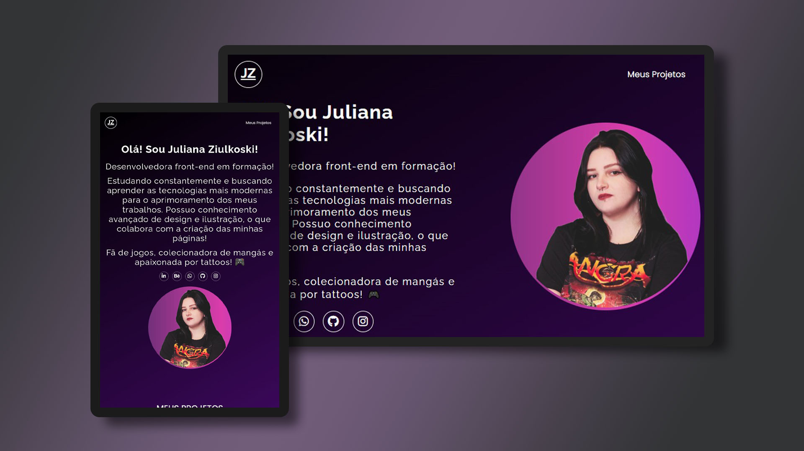

# meu-portfolio

<h1 align="center"> Portfólio Juliana Ziulkoski </h1>

Portfólio pessoal desenvolvido com base no projeto do Dev em Dobro.

 

  

## 🚀 Tecnologias

Esse projeto foi desenvolvido com as seguintes tecnologias:

- HTML e CSS
- JavaScript
- Git e Github

## 💻 Projeto

A partir do projeto promovido pelo Dev em Dobro, houve o desenvolvimento de portfólio pessoal para conhecimento e aprimoramento de tecnologias front-end.
Idealizado pela equipe como primeiro projeto, tem o intuito de agregar os trabalhos realizados pelo desenvolvedor em uma só página.

## ☝️ Desenvolvimento

Utilizado HTML e CSS, aplicação de responsividade e botão 'mostrar mais' com JavaScript. Finalizado o projeto elaborado pelo Dev em Dobro, surgiu a necessidade de realizar manutenção em tags e critérios de responsividade, alterando a estrutura do código e corrigindo cores.